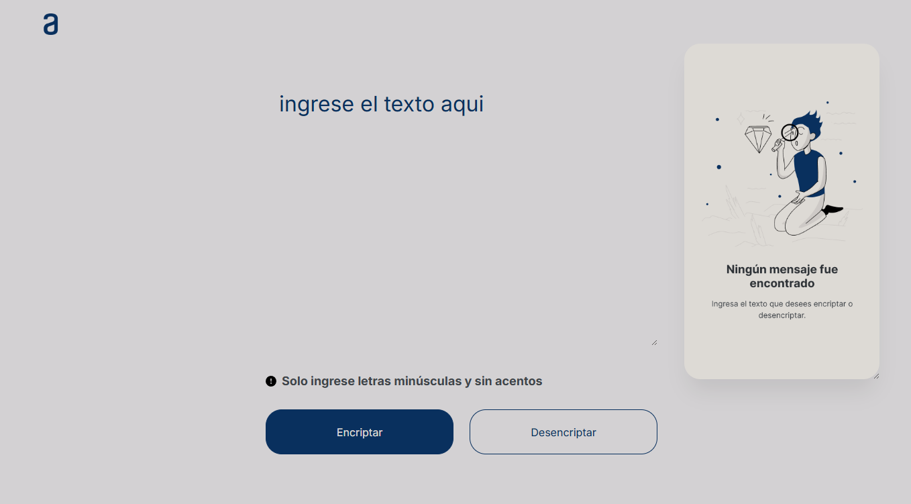

<div align="center">

## | EN 🔐 Text Encoder/Decoder | ES 🔐 Encriptador/Desencriptador de Texto | 
[EN English](#en-english) | [ES Español](#es-español) </br>
[[Demo](https://celesteamador.github.io/encriptador-texto/)]


</div>

## [EN English](#-english)

### Description  
A simple and intuitive web application that allows users to encrypt and decrypt text using a substitution cipher. 
The application transforms vowels into specific codes, making text unreadable to unauthorized users while providing an easy way to decode it back to the original message.
The encryption rules are as follows:
- The letter "e" is converted to "enter"
- The letter "i" is converted to "imes"
- The letter "a" is converted to "ai"
- The letter "o" is converted to "ober"
- The letter "u" is converted to "ufat"

### 🔐 Encryption Rules
1. 📝 Enter text using only lowercase letters and no accents
2. 🔄 Transform vowels: a→ai, e→enter, i→imes, o→ober, u→ufat
3. 📋 Copy the encrypted/decrypted result
4. 🔓 Reverse the process to decrypt text

### ⚙️ Technologies used  
- **HTML5** - Application structure (frontend)
- **CSS3** - Style and responsive design (frontend)
- **JavaScript (ES6+)** - Encryption/decryption logic (backend) 

### ✨ Features  
- Real-time text encryption and decryption
- Input validation (lowercase letters only, no accents)
- Copy to clipboard functionality
- Clean and user-friendly interface
- Responsive design for all devices

### 📸 Screenshot
<div align="center">
  
  
</div>

### Project structure
```
encriptador-texto/
├─ img/
│   ├─ bi_exclamation-circle-fill.png
│   ├─ exclamation-circle-fill.svg
│   ├─ frame7.png
│   ├─ logo.png
│   └─ screenshots/
│       ├─ desktop-screenshot.png
│       └─ mobile-screenshot.png
├─ index.html
├─ script.js
├─ style.css
└─ README.md
```

### How it works
**Encryption example:**
- Input: `"hello world"`
- Output: `"henterlloberllo wobermeslrd"`

**Decryption example:**
- Input: `"henterlloberllo wobermeslrd"`
- Output: `"hello world"`

### What I learned  
- String manipulation and replacement algorithms in JavaScript
- DOM manipulation for dynamic user interfaces
- Input validation and user experience best practices
- Clipboard API implementation for copy functionality
- Creating clean and intuitive web applications

### 🚀 Installation & usage  
1. Clone the repository:  
```bash
git clone https://github.com/celesteamador/encriptador-texto.git
cd encriptador-texto
```
2. Open `index.html` in your browser or use a local HTTP server
- Local HTTP server with Python
```bash
# From the project folder
python -m http.server 8000
# Then open http://localhost:8000
```
- Local HTTP server with Node:
```bash
npm i -g http-server
http-server -p 8000
# Open http://localhost:8000
```

### 🔐 Demo
- [Try it here](https://celesteamador.github.io/encriptador-texto/)

### 📄 License
This project is licensed under the MIT license.


## [ES Español](#-español)

### Descripción  
Una aplicación web simple e intuitiva que permite a los usuarios encriptar y desencriptar texto usando un cifrado por sustitución. 
La aplicación transforma las vocales en códigos específicos, haciendo el texto ilegible para usuarios no autorizados mientras proporciona una forma fácil de decodificarlo de vuelta al mensaje original.
Las reglas de encriptación son las siguientes:
- La letra "e" es convertida para "enter"
- La letra "i" es convertida para "imes"
- La letra "a" es convertida para "ai"
- La letra "o" es convertida para "ober"
- La letra "u" es convertida para "ufat"

### 🔐 Reglas de encriptación
1. 📝 Ingresa texto usando solo letras minúsculas y sin acentos
2. 🔄 Transforma vocales: a→ai, e→enter, i→imes, o→ober, u→ufat
3. 📋 Copia el resultado encriptado/desencriptado
4. 🔓 Invierte el proceso para desencriptar texto

### ⚙️ Tecnologías utilizadas  
- **HTML5** - Estructura de la aplicación (frontend)
- **CSS3** - Estilo y diseño responsivo (frontend)
- **JavaScript (ES6+)** - Lógica de encriptación/desencriptación (backend) 

### ✨ Características  
- Encriptación y desencriptación de texto en tiempo real
- Validación de entrada (solo letras minúsculas, sin acentos)
- Funcionalidad de copiar al portapapeles
- Interfaz limpia y fácil de usar
- Diseño responsivo para todos los dispositivos

### 📸 Captura de pantalla
<div align="center">
  
  
</div>

### Estructura del proyecto
```
encriptador-texto/
├─ img/
│   ├─ bi_exclamation-circle-fill.png
│   ├─ exclamation-circle-fill.svg
│   ├─ frame7.png
│   ├─ logo.png
│   └─ screenshots/
│       ├─ desktop-screenshot.png
│       └─ mobile-screenshot.png
├─ index.html
├─ script.js
├─ style.css
└─ README.md
```

### Cómo funciona
**Ejemplo de encriptación:**
- Entrada: `"hola mundo"`
- Salida: `"hoberlai mufatndober"`

**Ejemplo de desencriptación:**
- Entrada: `"hoberlai mufatndober"`
- Salida: `"hola mundo"`

### Lo que aprendí  
- Manipulación y reemplazo de cadenas con algoritmos en JavaScript
- Manipulación del DOM para interfaces de usuario dinámicas
- Validación de entrada y mejores prácticas de experiencia de usuario
- Implementación de la API del portapapeles para funcionalidad de copiado
- Creación de aplicaciones web limpias e intuitivas

### 🚀 Instalación & uso  
1. Clona el repositorio:  
```bash
git clone https://github.com/celesteamador/encriptador-texto.git
cd encriptador-texto
```
2. Abre `index.html` en tu navegador o utiliza un servidor HTTP local
- Servidor HTTP local con Python
```bash
# Desde la carpeta del proyecto
python -m http.server 8000
# Luego abre http://localhost:8000
```
- Servidor HTTP local con Node:
```bash
npm i -g http-server
http-server -p 8000
# Abre http://localhost:8000
```

### 🔐 Demo
- [Pruébalo aquí](https://celesteamador.github.io/encriptador-texto/)

### 📄 Licencia
Este proyecto está bajo la licencia MIT.